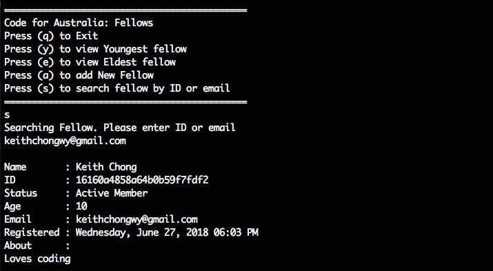
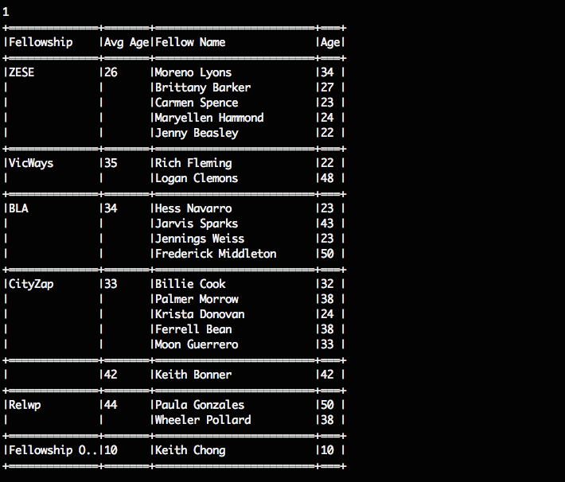

# Code for Australia Fellowship Viewer

## Objectives & Requirements
1. Take a deep breath.

2. Read and Store fellows dataset (fellows_dataset.json)

3. Display:
  * Group the fellows per fellowship and display their name and age.
  * Average age of each group of fellows per fellowship.
  * Information related to the oldest and youngest fellow in the dataset, including the fellowship that they belong to.

4. Include functionality to add new fellows.

## Installation & Setup

1. Install Homebrew

  ```
  /usr/bin/ruby -e "$(curl -fsSL https://raw.githubusercontent.com/Homebrew/install/master/install)"
  ```

* Or Update: `brew update`

2. Install Rbenv and Ruby Build

  ```
  brew install rbenv ruby-build
  ```

* Or Re-install: `brew reinstall rbenv ruby-build`
* Optional: Install Git if not installed with `brew install git`

3. Install Ruby version 2.4.2

  ```
  rbenv install 2.4.2
  ```


* Or [change ruby version](https://makandracards.com/makandra/21545-rbenv-how-to-switch-to-another-ruby-version-temporarily-per-project-or-globally)

4. Clone Repository & change directory

  ```
  git clone git@github.com:keitheous/CFA-Fellowship-Viewer.git
  ```

  ```
  cd CFA-Fellowship-Viewer
  ```

5. Bundle install

  ```
  Bundle install
  ```

* You might be required to install bundler gem with `gem install bundler` prior to bundle install

6. Optional: To run test

  ```
  rspec spec
  ```

## Launching the Application
1. To launch the application:

  ```
  ruby main.rb
  ```

2. This is the Main Menu.

  

3. From the Main Menu. Press `1` to View all fellowship groups sorted by Fellowship.

  

4. From the Main Menu. Press `2` to Access Fellows Menu.

  

5. From Fellows Menu. Press `y` to view the youngest fellow.

  

6. From Fellows Menu. Press `e` to view the youngest fellow.

  

7. From Fellows Menu. Press `a` to add new fellow.

  

8. From Fellows Menu. Press `s` to search fellow by ID or Email.

  

9. The Fellowship list should now include the newly added fellow.

  

## Discussions
1. I took the object oriented approach and built a Command Line Interface(CLI) instead of using a framework (such as Ruby or Sinatra) because it is simple and light-weight.

2. The object oriented design aids separation of concerns and make code less coupled and more cohesive. Below is a list of the classes and their single responsibility.
  * Fellow - Represent a fellow object.
  * Age - Handles anything related to fellows' age.
  * JsonParser - parses fellows_dataset.json
  * CLI/Viewer - Display Fellowship groups in a table

  Entry Points:
  * CLI/Cli - Manage User Interactions
  * Fellowship - Entry Point. Process

3. It was quite challenging to calculate the Average Age of each Fellowship Groups and display them in the Viewer without breaking the Single Responsibility Principle. After some consideration, I have decided to create the method `calculate_average_per_group` (age) inside Age class although it is not related to the states of Age (max and min). This provides a temporary solution for now.

4. Fellowship not only has the functionality to read and store Fellows from fellows_dataset.json, with the help of JsonParser, but also add new fellows member. With fellowship being the entry point, it also needs the ability to sort fellows into their group of fellowships(new or exisiting). After sorting members into their respectives group, the average ages are calculated and assigned to the groups.

5. Two of Fellowship's attributes, Groups(Hash) and Dataset(Array). Groups is used by the Viewer to render Fellowship information which are already sorted into fellowship groups. Dataset, on the other hand, simply holds the information of all fellows, which makes any form of search much simpler using the Array.select method. When a new fellow is added into the system through the CLI, it is first pushed into Dataset before sorted into Groups. Age recalculates the average age per group and also checks if the new member is either the eldest or youngest fellow.

```
class Fellowship

  ...

  def add_fellow(fellow_args = {}, fellow_class = Fellow)
    return require_fellow_details if fellow_args.empty?

    new_fellow = fellow_class.new(fellow_args)

    create_new_profile(new_fellow)
  end


  private

  def create_new_profile(fellow)
    age.add_new(fellow.age)

    dataset << fellow

    distribute_fellow(fellow)

    set_average_ages
  end

  def set_average_ages
    groups.keys.each do |key|
      average = age.calculate_average_per_group(groups[key][:fellows])

      groups[key].merge!(:average_age => average)
    end
  end
end

```

6. In the process of identifying youngest and eldest fellows, it occurred to me that there can be more than 1 youngest or eldest. Therefore, while searching through the dataset, **an array was to be expected** before listing the results.

Referring to *line 82 of cli.rb*:
```
example:

youngest_age = 19

dataset.select{|fellow| fellow.send('age') == youngest_age}.each{|fellow| fellow.to_s}
 <------- searching for fellow with youngest age -------->  <- print fellow details ->
```

I have also decided to add the functionality to search fellow by Unique ID or Email. All I had to do is reuse the method above since it is available and made sense to include this functionality.

Reusing code to search for email and id:
```
dataset.select{|fellow| fellow.send('email') == 'qwe@qwe.co'}

dataset.select{|fellow| fellow.send('id') == '456qw9eqwndoiuoqwk'}
```

Referring to the fourth line below and knowing that an array was to be expected, I have decided to use [unique total set](http://www.chrisrolle.com/en/blog/array-coherences) to identify if the search is successful or not.
```
def search_fellow
  puts "Searching Fellow. Please enter ID or email"
  input = gets.chomp
  search_result = search_fellow_by('id', input) | search_fellow_by('email', input)

  return unregistered_fellow if search_result.empty?
  print_fellows(search_result)
end
```
An unsuccessful search would return an empty array.

Here are some interesting facts!
* `nil ||  [] => []      <-- OR Operator`
* `[]  || nil => []      <-- OR Operator`
* `[]  || [1] => []      <-- OR Operator`
* `[1] |  [2] => [1, 2]  <-- Unique total set`
* `[]  |  [2] => [2]     <-- Unique total set`

## Future Improvements
1. If I had more time, I would write better tests and have better names for my classes and methods.
2. I could implement a single page application with a basic CRUD system to add fellows and make the UX pretty using bootstrap.

## Author
##### Keith Chong
